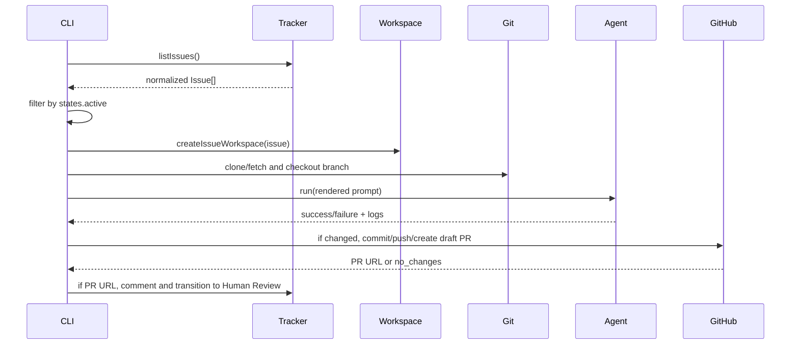

# Owned Symphony


Owned Symphony is a TypeScript, CLI-first, tracker-agnostic coding-agent orchestrator inspired by
OpenAI Symphony. It reads eligible issue tracker work items, normalizes them into a shared issue
model, creates isolated workspaces, renders prompts from `WORKFLOW.md`, runs a configured agent, and
prepares code changes for human review through draft GitHub pull requests.

> [!IMPORTANT]
> This repository is an owned implementation. The local `SPEC.md` and OpenAI Symphony project are
> architectural inspiration only; this codebase is not a wrapper around the reference
> implementation.

---

## Languages

- [English](#english)
- [简体中文](#简体中文)
- [繁體中文](#繁體中文)

---

## English

### Table of Contents

- [Project Overview](#project-overview)
- [Current Feature Matrix](#current-feature-matrix)
- [Architecture](#architecture)
- [Repository Layout](#repository-layout)
- [Requirements](#requirements)
- [Quick Start](#quick-start)
- [Workflow Configuration](#workflow-configuration)
- [CLI Commands](#cli-commands)
- [Runtime Behavior](#runtime-behavior)
- [Extending the Project](#extending-the-project)
- [Safety Model](#safety-model)
- [Tests](#tests)
- [Roadmap](#roadmap)

### Project Overview

This project is an owned Symphony-style orchestrator that connects issue trackers such as Jira and
Plane to coding agents such as Codex. It reads eligible issues, creates isolated workspaces, renders
prompts from `WORKFLOW.md`, runs an agent, and prepares code changes for human review.

It solves a narrow automation problem:

| Problem | Current implementation |
| --- | --- |
| Work lives in trackers | Mock, Jira, and Plane tracker adapters normalize issues into one `Issue` model. |
| Agents need isolated checkouts | Each issue gets a deterministic workspace under the configured workspace root. |
| Prompts should live with the repo | `WORKFLOW.md` front matter config plus Markdown prompt body are parsed locally. |
| Code changes need human review | Git changes can be committed, pushed, and opened as draft GitHub PRs. |
| Tracker state should reflect handoff | Jira and Plane can receive a PR comment and transition to Human Review after PR creation succeeds. |

### Current Feature Matrix

| Area | Implemented | Notes |
| --- | --- | --- |
| CLI | Yes | `validate`, `dry-run`, `run` |
| TypeScript build | Yes | Node.js 22+, ESM |
| `WORKFLOW.md` parser | Yes | YAML-like front matter plus Markdown body; intentionally small parser |
| Schema validation | Yes | Validates supported tracker, repo, GitHub, agent, states, and limits |
| Environment interpolation | Yes | `${ENV_NAME}` in workflow config |
| Secret redaction | Yes | Redacts common token/key forms in CLI/log output |
| Mock tracker | Yes | JSON file based |
| Jira tracker | Yes | JQL fetch, issue normalization, PR comment, transition |
| Plane tracker | Yes | Work-item fetch, normalization, PR comment, state transition |
| Workspace creation | Yes | Safe path checks under configured root |
| Git clone/branch prep | Yes | Clone or fetch existing repo; checkout issue branch |
| Dry-run agent | Yes | Writes prompt log, does not modify repo |
| Codex agent | Yes | Runs configured Codex command through a generic process runner |
| Logs and timeout | Yes | Agent and PR commands capture logs; Codex runner supports timeout |
| Draft GitHub PR creation | Yes | Uses `gh pr create --draft`; never merges |
| Docker | Planned | Not implemented |
| Long-running daemon/server | Planned | Not implemented |
| Dashboard | Planned | Not implemented |
| Auto-merge | Not planned | Explicitly out of scope |

### Architecture

```mermaid
flowchart LR
    A[Issue Tracker<br/>Mock / Jira / Plane] --> B[TrackerAdapter]
    B --> C[Normalized Issue Model]
    C --> D[CLI Orchestration<br/>validate / dry-run / run]
    D --> E[WorkspaceManager]
    E --> F[GitService<br/>clone / branch]
    F --> G[Prompt Renderer<br/>WORKFLOW.md]
    G --> H[AgentRunner<br/>DryRun / Codex]
    H --> I[GitHubPullRequestService<br/>commit / push / draft PR]
    I --> J[Tracker Writeback<br/>comment + Human Review]
```



Core abstractions:

| Interface / module | Responsibility |
| --- | --- |
| `TrackerAdapter` | Fetch work items and optionally write PR comments / transitions. |
| `WorkspaceManager` | Create safe per-issue workspace paths. |
| `GitService` | Clone/fetch repositories and prepare branches. |
| `AgentRunner` | Run an implementation-specific coding agent. |
| `GitHubPullRequestService` | Detect changes, commit, push, and create a draft PR. |
| `PromptRenderer` | Render `{{issue.*}}` and `{{config.*}}` placeholders. |

### Repository Layout

```text
src/
  agents/       AgentRunner interface, DryRunRunner, CodexRunner, process execution
  cli/          CLI entrypoint
  config/       Environment interpolation
  git/          Branch naming and Git preparation
  github/       Draft pull request creation through gh
  logging/      Secret redaction
  templates/    Prompt rendering
  trackers/     Mock, Jira, and Plane adapters
  workflow/     WORKFLOW.md parser and schema validation
  workspaces/   Safe path validation and workspace creation

examples/
  WORKFLOW.mock.example.md
  WORKFLOW.jira.example.md
  WORKFLOW.plane.example.md
  mock-issues.json

tests/
  *.test.ts
```

### Requirements

- Node.js `>=22`
- npm
- Git
- For real Codex runs: `codex` CLI available on `PATH`
- For draft GitHub PR creation: `gh` CLI authenticated for the target repository
- For Jira: Jira Cloud base URL, email, and API token
- For Plane: Plane API base URL and API key

> [!NOTE]
> Unit tests mock Jira, Plane, GitHub PR process execution, and Codex process execution. They do not
> require real external credentials.

### Quick Start

```bash
npm install
npm test
```

Validate the mock workflow:

```bash
npm run validate -- examples/WORKFLOW.mock.example.md
```

Preview the work that would be done:

```bash
npm run dry-run -- examples/WORKFLOW.mock.example.md
```

Run the mock workflow with the dry-run runner:

```bash
npm run build
node dist/src/cli/index.js run examples/WORKFLOW.mock.example.md
```

With the checked-in mock example, the dry-run agent does not change files, so PR creation is skipped
with `skippedReason: "no_changes"`.

### Workflow Configuration

The orchestrator reads a `WORKFLOW.md` file with front matter and a Markdown prompt body.

Minimal mock example:

```yaml
---
version: 1
tracker:
  kind: mock
  issue_file: ./mock-issues.json
workspace:
  root: ../.symphony/workspaces
repository:
  url: ..
  base_branch: main
  clone_dir: repo
branch:
  prefix: symphony
github:
  kind: gh
  remote: origin
  draft: true
  log_dir: ../.symphony/logs
agent:
  kind: dry-run
  timeout_seconds: 300
  log_dir: ../.symphony/logs
states:
  active: ["Ready", "In Progress"]
  terminal: ["Done", "Canceled"]
limits:
  max_concurrency: 1
---
# Agent Task

Implement {{issue.identifier}}: {{issue.title}}

{{issue.description}}
```

Supported tracker kinds:

| Tracker | Required config |
| --- | --- |
| `mock` | `issue_file` |
| `jira` | `base_url`, `email`, `api_token`, `jql`; optional `max_results`, `review_transition` |
| `plane` | `base_url`, `api_key`, `workspace_slug`, `project_id`; optional `max_results`, `review_state` |

Supported agent kinds:

| Agent | Behavior |
| --- | --- |
| `dry-run` | Writes the rendered prompt to a log and exits successfully. |
| `codex` | Runs configured `command` and `args`, sends the rendered prompt on stdin, captures stdout/stderr, and enforces `timeout_seconds`. |

### CLI Commands

| Command | What it does | External writes |
| --- | --- | --- |
| `orchestrator validate ./WORKFLOW.md` | Parses config, interpolates env vars, validates schema, prints redacted config. | No |
| `orchestrator dry-run ./WORKFLOW.md` | Fetches tracker issues, filters active states, prints planned workspace/Git/PR commands and rendered prompt. | No tracker writes, no Git writes |
| `orchestrator run ./WORKFLOW.md` | Fetches active issues, prepares workspace/repo branch, runs agent, creates draft PR if changes exist, then writes PR link and Human Review transition when supported. | Yes |

The npm scripts wrap build plus selected CLI commands:

```bash
npm run validate -- examples/WORKFLOW.mock.example.md
npm run dry-run -- examples/WORKFLOW.mock.example.md
```

### Runtime Behavior



Important details:

- `run` processes up to `limits.max_concurrency`, currently validated to `1`.
- Workspaces are not deleted automatically.
- PRs are always draft PRs.
- The code never calls `gh pr merge` or `git merge`.
- Tracker writeback happens only after a PR URL exists.

### Extending the Project

Add a new tracker:

1. Implement `TrackerAdapter` in `src/trackers/`.
2. Normalize external work items into `Issue`.
3. Add optional `addPullRequestComment` and `transitionToHumanReview` if writeback is supported.
4. Register the adapter in `src/trackers/createTracker.ts`.
5. Extend workflow schema validation in `src/workflow/schema.ts`.
6. Add mocked unit tests; do not require real credentials.

Add a new agent runner:

1. Implement `AgentRunner` in `src/agents/`.
2. Return `AgentRunResult` with logs, exit code, timeout status, stdout, and stderr.
3. Register it in `src/agents/createAgentRunner.ts`.
4. Add schema validation and mocked process tests.

### Safety Model

> [!WARNING]
> `run` can execute Git, Codex, GitHub CLI, and tracker write APIs depending on workflow config. Use
> `validate` and `dry-run` first.

Implemented safety constraints:

- Secret redaction for common API tokens and keys.
- Workspace paths must stay inside the configured workspace root.
- `github.draft` must be `true`.
- Max concurrency is currently restricted to `1`.
- No auto-merge behavior exists.
- Jira and Plane writeback occurs only after draft PR creation returns a URL.

### Tests

```bash
npm test
```

Current test coverage includes:

- Workflow parsing and validation
- Environment interpolation
- Secret redaction
- Mock tracker
- Jira tracker HTTP behavior and normalization
- Plane tracker HTTP behavior and normalization
- Workspace path safety
- Git clone/branch behavior with a local repository
- Dry-run and Codex runner behavior with mocked process execution
- Draft GitHub PR command flow with mocked process execution

### Roadmap

Planned, not currently implemented:

- Docker Compose runtime
- Long-running daemon/poll loop
- Web dashboard or status UI
- Rich retry/reconciliation state
- Additional trackers beyond Mock/Jira/Plane
- Additional agent runners beyond DryRun/Codex

Not planned:

- Automatic PR merge

---

## 简体中文

### 目录

- [项目概览](#项目概览)
- [当前功能矩阵](#当前功能矩阵)
- [架构](#架构)
- [本地运行](#本地运行)
- [配置与命令](#配置与命令)
- [扩展方式](#扩展方式)
- [安全边界](#安全边界)
- [路线图](#路线图)

### 项目概览

Owned Symphony 是一个受 OpenAI Symphony 启发、但由本仓库自行实现的 TypeScript CLI 编排器。它的目标是把 Jira、Plane 或 Mock tracker 中的工作项，转成隔离的 coding-agent 执行流程：读取符合条件的 issue，创建独立 workspace，克隆目标仓库，使用 `WORKFLOW.md` 渲染 prompt，运行 DryRun 或 Codex agent，并在有代码变更时创建 GitHub draft PR 供人工审查。

> [!IMPORTANT]
> 本项目不是 OpenAI Symphony 参考实现的封装。`SPEC.md` 仅作为架构参考。

### 当前功能矩阵

| 模块 | 状态 | 说明 |
| --- | --- | --- |
| CLI | 已实现 | `validate`、`dry-run`、`run` |
| `WORKFLOW.md` 解析 | 已实现 | front matter + Markdown prompt body |
| Mock tracker | 已实现 | 读取本地 JSON issue |
| Jira adapter | 已实现 | JQL 获取、标准化、评论、流转到 Human Review |
| Plane adapter | 已实现 | work-item 获取、标准化、评论、流转到 Human Review |
| Workspace | 已实现 | 每个 issue 一个安全路径 |
| Git | 已实现 | clone/fetch、创建 issue branch |
| DryRunRunner | 已实现 | 写 prompt log，不修改代码 |
| CodexRunner | 已实现 | 调用配置的 Codex 命令，支持 timeout 和日志 |
| GitHub draft PR | 已实现 | 通过 `gh` 检测变更、commit、push、创建 draft PR |
| Docker | 计划中 | 尚未实现 |
| 后台 daemon / server | 计划中 | 尚未实现 |
| Dashboard | 计划中 | 尚未实现 |
| 自动 merge | 不计划 | 明确不会实现 |

### 架构

```mermaid
flowchart LR
    A[Issue Tracker<br/>Mock / Jira / Plane] --> B[TrackerAdapter]
    B --> C[统一 Issue 模型]
    C --> D[CLI 编排<br/>validate / dry-run / run]
    D --> E[WorkspaceManager]
    E --> F[GitService<br/>clone / branch]
    F --> G[Prompt Renderer<br/>WORKFLOW.md]
    G --> H[AgentRunner<br/>DryRun / Codex]
    H --> I[GitHubPullRequestService<br/>commit / push / draft PR]
    I --> J[Tracker 回写<br/>评论 + Human Review]
```



核心模块：

| 模块 | 职责 |
| --- | --- |
| `TrackerAdapter` | 获取工作项，并在支持时写入 PR 评论和状态流转。 |
| `WorkspaceManager` | 创建受控的 per-issue workspace。 |
| `GitService` | 克隆或更新仓库，并创建分支。 |
| `AgentRunner` | 抽象 DryRun 和 Codex 等 agent。 |
| `GitHubPullRequestService` | 检测变更、commit、push、创建 draft PR。 |

### 本地运行

```bash
npm install
npm test
```

校验 Mock workflow：

```bash
npm run validate -- examples/WORKFLOW.mock.example.md
```

预览执行计划：

```bash
npm run dry-run -- examples/WORKFLOW.mock.example.md
```

运行 Mock workflow：

```bash
npm run build
node dist/src/cli/index.js run examples/WORKFLOW.mock.example.md
```

> [!NOTE]
> Mock 示例使用 `dry-run` agent，不会修改代码；因此通常会跳过 PR 创建，并返回
> `skippedReason: "no_changes"`。

### 配置与命令

`WORKFLOW.md` 由 YAML-like front matter 和 Markdown prompt body 组成。示例见：

- `examples/WORKFLOW.mock.example.md`
- `examples/WORKFLOW.jira.example.md`
- `examples/WORKFLOW.plane.example.md`

支持的 tracker：

| Tracker | 必填配置 |
| --- | --- |
| `mock` | `issue_file` |
| `jira` | `base_url`、`email`、`api_token`、`jql` |
| `plane` | `base_url`、`api_key`、`workspace_slug`、`project_id` |

命令：

| 命令 | 行为 | 是否写外部系统 |
| --- | --- | --- |
| `validate` | 解析并校验 workflow，输出脱敏配置。 | 否 |
| `dry-run` | 获取 issue，渲染 prompt，打印 Git/PR 执行计划。 | 不写 tracker，不写 Git |
| `run` | 准备 workspace、运行 agent、有变更时创建 draft PR，并回写 tracker。 | 是 |

### 扩展方式

新增 tracker：

1. 在 `src/trackers/` 实现 `TrackerAdapter`。
2. 将外部数据标准化为 `Issue`。
3. 如支持回写，实现 `addPullRequestComment` 和 `transitionToHumanReview`。
4. 在 `createTracker.ts` 注册。
5. 在 `workflow/schema.ts` 增加配置校验。
6. 添加不依赖真实凭证的 mock 测试。

新增 agent runner：

1. 实现 `AgentRunner`。
2. 返回统一的 `AgentRunResult`。
3. 在 `createAgentRunner.ts` 注册。
4. 添加 schema 校验和 mock process 测试。

### 安全边界

> [!WARNING]
> `run` 会根据配置调用 Git、Codex、GitHub CLI 和 tracker 写接口。建议先运行
> `validate` 和 `dry-run`。

已实现的安全约束：

- 常见 token/key 脱敏。
- workspace 路径必须位于配置的 workspace root 内。
- GitHub PR 必须是 draft。
- 当前最大并发限制为 `1`。
- 不存在自动 merge 功能。
- 只有成功创建 PR URL 后，才会回写 Jira 或 Plane。

### 路线图

计划中，尚未实现：

- Docker Compose
- 长驻 daemon / polling loop
- Web dashboard
- 更完整的 retry / reconciliation 状态
- 更多 tracker 和 agent runner

---

## 繁體中文

### 目錄

- [專案概覽](#專案概覽)
- [目前功能矩陣](#目前功能矩陣)
- [架構](#架構-1)
- [本機執行](#本機執行)
- [設定與命令](#設定與命令)
- [擴充方式](#擴充方式)
- [安全邊界](#安全邊界)
- [路線圖](#路線圖)

### 專案概覽

Owned Symphony 是一個受 OpenAI Symphony 啟發、但由本儲存庫自行實作的 TypeScript CLI 編排器。它會把 Jira、Plane 或 Mock tracker 中符合條件的工作項，轉成隔離的 coding-agent 執行流程：讀取 issue、建立獨立 workspace、clone 目標 repo、使用 `WORKFLOW.md` 渲染 prompt、執行 DryRun 或 Codex agent，並在有程式碼變更時建立 GitHub draft PR 供人工審查。

> [!IMPORTANT]
> 本專案不是 OpenAI Symphony 參考實作的包裝。`SPEC.md` 只作為架構參考。

### 目前功能矩陣

| 模組 | 狀態 | 說明 |
| --- | --- | --- |
| CLI | 已實作 | `validate`、`dry-run`、`run` |
| `WORKFLOW.md` 解析 | 已實作 | front matter + Markdown prompt body |
| Mock tracker | 已實作 | 讀取本機 JSON issue |
| Jira adapter | 已實作 | JQL 取得、標準化、留言、流轉到 Human Review |
| Plane adapter | 已實作 | work-item 取得、標準化、留言、流轉到 Human Review |
| Workspace | 已實作 | 每個 issue 一個安全路徑 |
| Git | 已實作 | clone/fetch、建立 issue branch |
| DryRunRunner | 已實作 | 寫入 prompt log，不修改程式碼 |
| CodexRunner | 已實作 | 呼叫設定的 Codex 命令，支援 timeout 和 logs |
| GitHub draft PR | 已實作 | 透過 `gh` 偵測變更、commit、push、建立 draft PR |
| Docker | Roadmap | 尚未實作 |
| 常駐 daemon / server | Roadmap | 尚未實作 |
| Dashboard | Roadmap | 尚未實作 |
| 自動 merge | 不計畫 | 明確不支援 |

### 架構


核心模組：

| 模組 | 職責 |
| --- | --- |
| `TrackerAdapter` | 取得工作項，並在支援時寫入 PR 留言和狀態流轉。 |
| `WorkspaceManager` | 建立受控的 per-issue workspace。 |
| `GitService` | clone 或更新 repo，並建立分支。 |
| `AgentRunner` | 抽象 DryRun 和 Codex 等 agent。 |
| `GitHubPullRequestService` | 偵測變更、commit、push、建立 draft PR。 |

### 本機執行

```bash
npm install
npm test
```

校驗 Mock workflow：

```bash
npm run validate -- examples/WORKFLOW.mock.example.md
```

預覽執行計畫：

```bash
npm run dry-run -- examples/WORKFLOW.mock.example.md
```

執行 Mock workflow：

```bash
npm run build
node dist/src/cli/index.js run examples/WORKFLOW.mock.example.md
```

> [!NOTE]
> Mock 範例使用 `dry-run` agent，不會修改程式碼；因此通常會略過 PR 建立，並回傳
> `skippedReason: "no_changes"`。

### 設定與命令

`WORKFLOW.md` 由 YAML-like front matter 和 Markdown prompt body 組成。範例見：

- `examples/WORKFLOW.mock.example.md`
- `examples/WORKFLOW.jira.example.md`
- `examples/WORKFLOW.plane.example.md`

支援的 tracker：

| Tracker | 必填設定 |
| --- | --- |
| `mock` | `issue_file` |
| `jira` | `base_url`、`email`、`api_token`、`jql` |
| `plane` | `base_url`、`api_key`、`workspace_slug`、`project_id` |

命令：

| 命令 | 行為 | 是否寫入外部系統 |
| --- | --- | --- |
| `validate` | 解析並校驗 workflow，輸出脫敏設定。 | 否 |
| `dry-run` | 取得 issue，渲染 prompt，列印 Git/PR 執行計畫。 | 不寫 tracker，不寫 Git |
| `run` | 準備 workspace、執行 agent、有變更時建立 draft PR，並回寫 tracker。 | 是 |

### 擴充方式

新增 tracker：

1. 在 `src/trackers/` 實作 `TrackerAdapter`。
2. 將外部資料標準化為 `Issue`。
3. 如支援回寫，實作 `addPullRequestComment` 和 `transitionToHumanReview`。
4. 在 `createTracker.ts` 註冊。
5. 在 `workflow/schema.ts` 增加設定校驗。
6. 加入不依賴真實憑證的 mock 測試。

新增 agent runner：

1. 實作 `AgentRunner`。
2. 回傳統一的 `AgentRunResult`。
3. 在 `createAgentRunner.ts` 註冊。
4. 加入 schema 校驗和 mock process 測試。

### 安全邊界

> [!WARNING]
> `run` 會依設定呼叫 Git、Codex、GitHub CLI 和 tracker 寫入 API。建議先執行
> `validate` 和 `dry-run`。

已實作的安全約束：

- 常見 token/key 脫敏。
- workspace 路徑必須位於設定的 workspace root 內。
- GitHub PR 必須是 draft。
- 目前最大並行限制為 `1`。
- 不存在自動 merge 功能。
- 只有成功取得 PR URL 後，才會回寫 Jira 或 Plane。

### 路線圖

Roadmap，尚未實作：

- Docker Compose
- 常駐 daemon / polling loop
- Web dashboard
- 更完整的 retry / reconciliation 狀態
- 更多 tracker 和 agent runner

---

## License

This project is licensed under the [Apache License 2.0](LICENSE).
