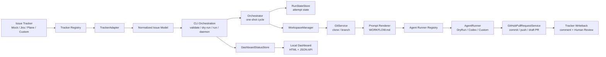
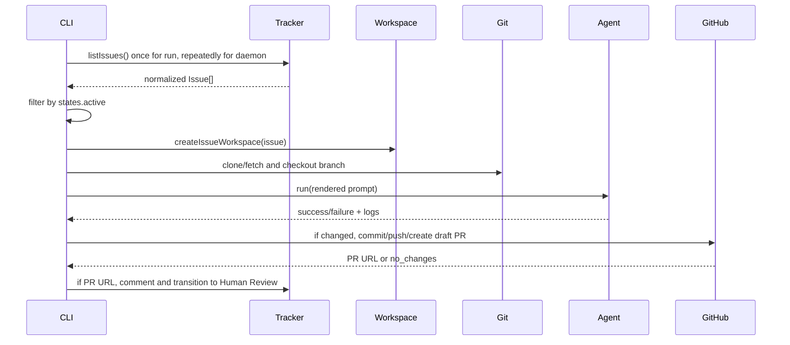
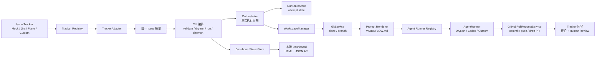
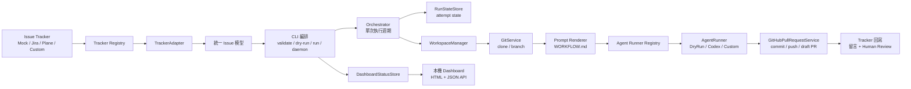

# Owned Symphony


Owned Symphony is a TypeScript, CLI-first, tracker-agnostic coding-agent orchestrator inspired by
OpenAI Symphony. It reads eligible issue tracker work items, normalizes them into a shared issue
model, creates isolated workspaces, renders prompts from `WORKFLOW.md`, runs a configured agent, and
prepares code changes for human review through draft GitHub pull requests.

> [!IMPORTANT]
> This repository is an owned implementation. The local `SPEC.md` and OpenAI Symphony project are
> architectural inspiration only; this codebase is not a wrapper around the reference
> implementation.

---

## Languages

- [English](#english)
- [简体中文](#简体中文)
- [繁體中文](#繁體中文)

---

## English

### Table of Contents

- [Project Overview](#project-overview)
- [Current Feature Matrix](#current-feature-matrix)
- [Architecture](#architecture)
- [Repository Layout](#repository-layout)
- [Requirements](#requirements)
- [Quick Start](#quick-start)
- [Docker Runtime](#docker-runtime)
- [Workflow Configuration](#workflow-configuration)
- [CLI Commands](#cli-commands)
- [Runtime Behavior](#runtime-behavior)
- [Extending the Project](#extending-the-project)
- [Safety Model](#safety-model)
- [Tests](#tests)
- [Roadmap](#roadmap)

### Project Overview

This project is an owned Symphony-style orchestrator that connects issue trackers such as Jira and
Plane to coding agents such as Codex. It reads eligible issues, creates isolated workspaces, renders
prompts from `WORKFLOW.md`, runs an agent, and prepares code changes for human review.

It solves a narrow automation problem:

| Problem | Current implementation |
| --- | --- |
| Work lives in trackers | Mock, Jira, and Plane tracker adapters normalize issues into one `Issue` model. |
| Agents need isolated checkouts | Each issue gets a deterministic workspace under the configured workspace root. |
| Prompts should live with the repo | `WORKFLOW.md` front matter config plus Markdown prompt body are parsed locally. |
| Code changes need human review | Git changes can be committed, pushed, and opened as draft GitHub PRs. |
| Tracker state should reflect handoff | Jira and Plane can receive a PR comment and transition to Human Review after PR creation succeeds. |

### Current Feature Matrix

| Area | Implemented | Notes |
| --- | --- | --- |
| CLI | Yes | `validate`, `dry-run`, `run`, `daemon` |
| TypeScript build | Yes | Node.js 22+, ESM |
| `WORKFLOW.md` parser | Yes | YAML-like front matter plus Markdown body; intentionally small parser |
| Schema validation | Yes | Validates supported tracker, repo, GitHub, agent, states, and limits |
| Environment interpolation | Yes | `${ENV_NAME}` in workflow config |
| Secret redaction | Yes | Redacts common token/key forms in CLI/log output |
| Mock tracker | Yes | JSON file based |
| Jira tracker | Yes | JQL fetch, issue normalization, PR comment, transition |
| Plane tracker | Yes | Work-item fetch, normalization, PR comment, state transition |
| Tracker registry | Yes | Mock, Jira, and Plane are registered through `src/trackers/registry.ts`; custom trackers can be added in code |
| Workspace creation | Yes | Safe path checks under configured root |
| Git clone/branch prep | Yes | Clone or fetch existing repo; checkout issue branch |
| Dry-run agent | Yes | Writes prompt log, does not modify repo |
| Codex agent | Yes | Runs configured Codex command through a generic process runner |
| Agent runner registry | Yes | DryRun and Codex are registered through `src/agents/registry.ts`; custom runners can be added in code |
| Logs and timeout | Yes | Agent and PR commands capture logs; Codex runner supports timeout |
| Draft GitHub PR creation | Yes | Uses `gh pr create --draft`; never merges |
| Docker Compose runtime | Yes | Runs the existing CLI with mounted config/workspaces/logs; no public ports |
| Long-running daemon | Yes | Polls the configured tracker until stopped |
| Retry/reconciliation state | Yes | In-memory attempt state with cooldown, max attempts, and candidate-state checks |
| Dashboard/status UI | Yes | Minimal local-only HTTP dashboard for daemon mode when enabled |
| Auto-merge | Not planned | Explicitly out of scope |

### Architecture



Core abstractions:

| Interface / module | Responsibility |
| --- | --- |
| `TrackerRegistry` | Registers tracker config validation and adapter creation by tracker `kind`. |
| `TrackerAdapter` | Fetch work items and optionally write PR comments / transitions. |
| `Orchestrator` | Runs one polling cycle over eligible issues. |
| `PollingDaemon` | Repeats orchestrator cycles at a configured interval until stopped. |
| `RunStateStore` | Stores attempt state; currently implemented in memory. |
| `DashboardStatusStore` | Maintains redacted daemon status for the local dashboard API. |
| `WorkspaceManager` | Create safe per-issue workspace paths. |
| `GitService` | Clone/fetch repositories and prepare branches. |
| `AgentRunnerRegistry` | Registers agent config validation and runner creation by agent `kind`. |
| `AgentRunner` | Run an implementation-specific coding agent. |
| `GitHubPullRequestService` | Detect changes, commit, push, and create a draft PR. |
| `PromptRenderer` | Render `{{issue.*}}` and `{{config.*}}` placeholders. |

### Repository Layout

```text
src/
  agents/       Agent runner registry, AgentRunner interface, DryRunRunner, CodexRunner, process execution
  cli/          CLI entrypoint
  config/       Environment interpolation
  dashboard/    Local status API and HTML dashboard
  daemon/       Polling loop for long-running daemon mode
  git/          Branch naming and Git preparation
  github/       Draft pull request creation through gh
  logging/      Secret redaction
  orchestrator/ One-shot orchestration cycle shared by run and daemon
  state/        RunStateStore interface and in-memory implementation
  templates/    Prompt rendering
  trackers/     Tracker registry plus Mock, Jira, and Plane adapters
  workflow/     WORKFLOW.md parser and schema validation
  workspaces/   Safe path validation and workspace creation

examples/
  ExampleAgentRunner.ts
  ExampleTrackerAdapter.ts
  WORKFLOW.quickstart.mock.md
  WORKFLOW.mock.example.md
  WORKFLOW.dashboard.mock.example.md
  WORKFLOW.docker.mock.example.md
  WORKFLOW.jira.example.md
  WORKFLOW.plane.example.md
  mock-issues.json

tests/
  *.test.ts
```

### Requirements

- Node.js `>=22`
- npm
- Git
- For real Codex runs: `codex` CLI available on `PATH`
- For draft GitHub PR creation: `gh` CLI authenticated for the target repository
- For Jira: Jira Cloud base URL, email, and API token
- For Plane: Plane API base URL and API key
- For Docker runtime: Docker Engine and Docker Compose

> [!NOTE]
> Unit tests mock Jira, Plane, GitHub PR process execution, and Codex process execution. They do not
> require real external credentials.

### Quick Start

```bash
npm install
npm run validate:mock
npm run dry-run:mock
```

Run one daemon polling cycle with the mock tracker:

```bash
npm run daemon:mock:once
```

Run the dashboard-enabled mock daemon:

```bash
npm run daemon:mock
```

Then open:

```text
http://127.0.0.1:4000
```

With the checked-in mock example, the dry-run agent does not change files, so PR creation is skipped
with `skippedReason: "no_changes"`.

### Docker Runtime

The repository includes a production-oriented multi-stage `Dockerfile` and `docker-compose.yml`.
The image runs the existing CLI entrypoint:

```text
node /app/dist/src/cli/index.js
```

The default container command is intentionally safe:

```text
validate /config/WORKFLOW.md
```

Build the image:

```bash
docker build -t owned-symphony:local .
```

Prepare host directories:

```bash
mkdir -p config workspaces logs
cp examples/WORKFLOW.docker.mock.example.md config/WORKFLOW.md
cp examples/mock-issues.json config/mock-issues.json
```

For Docker, adjust `config/WORKFLOW.md` so mounted paths are used:

```yaml
tracker:
  kind: mock
  issue_file: /config/mock-issues.json
workspace:
  root: /workspaces
github:
  log_dir: /logs
agent:
  log_dir: /logs
```

Run through Docker Compose:

```bash
npm run docker:build
npm run docker:dry-run
```

Or run Compose directly:

```bash
docker compose run --rm orchestrator validate /config/WORKFLOW.md
docker compose run --rm orchestrator dry-run /config/WORKFLOW.md
docker compose run --rm orchestrator run /config/WORKFLOW.md
docker compose run --rm orchestrator daemon /config/WORKFLOW.md
```

Equivalent profile services are also available:

```bash
docker compose --profile validate run --rm validate
docker compose --profile dry-run run --rm dry-run
docker compose --profile run run --rm run
docker compose --profile daemon run --rm daemon
```

Mounted volumes:

| Host path | Container path | Purpose |
| --- | --- | --- |
| `./config` | `/config` | Workflow files and non-secret configuration files. Mounted read-only. |
| `./workspaces` | `/workspaces` | Per-issue cloned repositories and working trees. |
| `./logs` | `/logs` | Agent, GitHub PR, and command logs. |

Environment variables:

| Variable | Used by |
| --- | --- |
| `JIRA_EMAIL` | Jira tracker authentication |
| `JIRA_API_TOKEN` | Jira tracker authentication |
| `PLANE_API_KEY` | Plane tracker authentication |
| `GH_TOKEN` or `GITHUB_TOKEN` | GitHub CLI authentication |
| `OPENAI_API_KEY` | Codex or model provider configuration, if needed |

See `examples/docker.env.example` for a non-secret template.

> [!WARNING]
> Do not bake secrets into the image. Pass secrets through environment variables or your runtime
> secret manager.

Docker limitations:

- No public ports are exposed.
- Docker Compose does not publish the dashboard port; keep any port mapping local-only if you add one.
- The image includes Git and GitHub CLI for PR creation.
- The image does not install the Codex CLI. For real `agent.kind: codex` runs, build a derived image
  that installs `codex`, or set `agent.command` to an executable available in the container.
- Workspaces are never deleted automatically.
- The CLI still never auto-merges PRs.

### Workflow Configuration

The orchestrator reads a `WORKFLOW.md` file with front matter and a Markdown prompt body.

Copy-pasteable examples:

| File | Purpose | External credentials |
| --- | --- | --- |
| `examples/WORKFLOW.quickstart.mock.md` | Fast local validation and dry-run. | No |
| `examples/WORKFLOW.mock.example.md` | Basic mock tracker example. | No |
| `examples/WORKFLOW.dashboard.mock.example.md` | Mock daemon with local dashboard enabled. | No |
| `examples/WORKFLOW.docker.mock.example.md` | Docker Compose mock workflow using `/config`, `/workspaces`, and `/logs`. | No |
| `examples/WORKFLOW.jira.example.md` | Jira + Codex example. | Requires Jira/Codex/GitHub environment. |
| `examples/WORKFLOW.plane.example.md` | Plane + Codex example. | Requires Plane/Codex/GitHub environment. |

Minimal mock shape:

```yaml
---
version: 1
tracker:
  kind: mock
  issue_file: ./mock-issues.json
workspace:
  root: ../.symphony/workspaces
repository:
  url: ..
  base_branch: main
  clone_dir: repo
branch:
  prefix: symphony
github:
  kind: gh
  remote: origin
  draft: true
  log_dir: ../.symphony/logs
agent:
  kind: dry-run
  timeout_seconds: 300
  log_dir: ../.symphony/logs
states:
  active: ["Ready", "In Progress"]
  terminal: ["Done", "Canceled"]
limits:
  max_concurrency: 1
retry:
  max_attempts: 2
  failure_cooldown_seconds: 300
  retryable_errors: ["agent_timeout", "network_error", "transient_tracker_error"]
daemon:
  poll_interval_seconds: 60
dashboard:
  enabled: false
  host: "127.0.0.1"
  port: 4000
---
# Agent Task

Implement {{issue.identifier}}: {{issue.title}}

{{issue.description}}
```

Supported tracker kinds:

| Tracker | Required config |
| --- | --- |
| `mock` | `issue_file` |
| `jira` | `base_url`, `email`, `api_token`, `jql`; optional `max_results`, `review_transition` |
| `plane` | `base_url`, `api_key`, `workspace_slug`, `project_id`; optional `max_results`, `review_state` |

Custom tracker kinds are supported through the tracker registry. They are not available from config
alone; the tracker must be implemented and registered in TypeScript first. See
[`docs/ADDING_TRACKERS.md`](docs/ADDING_TRACKERS.md).

Supported agent kinds:

| Agent | Behavior |
| --- | --- |
| `dry-run` | Writes the rendered prompt to a log and exits successfully. |
| `codex` | Runs configured `command` and `args`, sends the rendered prompt on stdin, captures stdout/stderr, and enforces `timeout_seconds`. |

Custom agent kinds are supported through the agent runner registry. They are not available from
config alone; the runner must be implemented and registered in TypeScript first. See
[`docs/ADDING_AGENT_RUNNERS.md`](docs/ADDING_AGENT_RUNNERS.md).

Daemon configuration:

| Field | Default | Behavior |
| --- | --- | --- |
| `daemon.poll_interval_seconds` | `60` | Wait time between polling cycles. Must be at least `1`. |

Retry and reconciliation configuration:

| Field | Default | Behavior |
| --- | --- | --- |
| `retry.max_attempts` | `2` | Attempts before an issue is marked `needs_human_attention`. |
| `retry.failure_cooldown_seconds` | `300` | Minimum wait before retrying a retryable failure. |
| `retry.retryable_errors` | `agent_timeout`, `network_error`, `transient_tracker_error` | Error codes that may be retried. |
| `retry.retry_with_existing_pull_request` | `false` | Prevents retry when internal state already has a PR URL. |
| `retry.rerun_succeeded` | `false` | Prevents rerunning issues that already succeeded. |

Run states:

```text
discovered -> queued -> preparing_workspace -> running_agent -> creating_pr
  -> commenting_tracker -> transitioning_tracker -> succeeded

Other terminal states: failed, skipped, needs_human_attention, cancelled
```

Dashboard configuration:

| Field | Default | Behavior |
| --- | --- | --- |
| `dashboard.enabled` | `false` | Starts the dashboard only in `daemon` mode when set to `true`. |
| `dashboard.host` | `127.0.0.1` | Local-only bind address by default. `localhost` is also treated as local. |
| `dashboard.port` | `4000` | HTTP port for the local dashboard. |

> [!WARNING]
> If `dashboard.host` is not `127.0.0.1` or `localhost`, the CLI prints a warning. The dashboard is an
> operator status surface and should not be exposed publicly.

Start daemon with the dashboard enabled:

```bash
npm run daemon:mock
```

Then open:

```text
http://127.0.0.1:4000
```

Dashboard API endpoints:

| Endpoint | Purpose |
| --- | --- |
| `GET /health` | Health and uptime summary. |
| `GET /api/status` | Current mode, uptime, polling interval, run counts, last poll, tracker kind, agent kind, and last error. |
| `GET /api/runs` | Active, succeeded, and failed run summaries. |
| `GET /api/runs/:issueIdentifier` | One run summary by issue identifier. |
| `GET /api/config-summary` | Redacted configuration summary. |

The dashboard does not return API tokens, environment variables, raw prompts, or raw tracker payloads.

### CLI Commands

| Command | What it does | External writes |
| --- | --- | --- |
| `orchestrator validate ./WORKFLOW.md` | Parses config, interpolates env vars, validates schema, prints redacted config. | No |
| `orchestrator dry-run ./WORKFLOW.md` | Fetches tracker issues, filters active states, prints planned workspace/Git/PR commands and rendered prompt. | No tracker writes, no Git writes |
| `orchestrator run ./WORKFLOW.md` | Fetches active issues, prepares workspace/repo branch, runs agent, creates draft PR if changes exist, then writes PR link and Human Review transition when supported. | Yes |
| `orchestrator daemon ./WORKFLOW.md` | Repeats the same one-shot run cycle until interrupted. | Yes, same as `run` |

For local checks, daemon mode also accepts `--max-cycles <n>`:

```bash
node dist/src/cli/index.js daemon examples/WORKFLOW.quickstart.mock.md --max-cycles 1
```

The npm scripts wrap build plus selected CLI commands:

```bash
npm run validate:mock
npm run dry-run:mock
npm run daemon:mock
npm run docker:build
npm run docker:dry-run
```

### Runtime Behavior



Important details:

- `run` processes up to `limits.max_concurrency`, currently validated to `1`.
- `daemon` reuses the same one-shot orchestration cycle and waits `daemon.poll_interval_seconds` between polls.
- `daemon` keeps in-memory run state and applies retry/reconciliation rules across polling cycles.
- Retry respects candidate tracker state, cooldown, max attempts, retryable error codes, existing PR URLs, and prior success.
- Reconciliation updates latest tracker state, skips non-candidate issues that are not running, and warns if a running issue moved to a terminal tracker state.
- Workspaces are not deleted automatically.
- PRs are always draft PRs.
- The code never calls `gh pr merge` or `git merge`.
- Tracker writeback happens only after a PR URL exists.

### Extending the Project

Add a new tracker:

1. Implement `TrackerAdapter` in `src/trackers/`.
2. Normalize external work items into `Issue`.
3. Add optional `addPullRequestComment` and `transitionToHumanReview` if writeback is supported.
4. Register the adapter and its config validator in `src/trackers/registry.ts`.
5. Add a workflow example if the config shape is useful to operators.
6. Add mocked unit tests; do not require real credentials.

See [`docs/ADDING_TRACKERS.md`](docs/ADDING_TRACKERS.md) and
[`examples/ExampleTrackerAdapter.ts`](examples/ExampleTrackerAdapter.ts) for the full pattern.

Add a new agent runner:

1. Implement `AgentRunner` in `src/agents/`.
2. Return `AgentRunResult` with logs, exit code, timeout status, stdout, and stderr.
3. Register the runner and its config validator in `src/agents/registry.ts`.
4. Add schema validation through the registry and mocked process or SDK tests.

See [`docs/ADDING_AGENT_RUNNERS.md`](docs/ADDING_AGENT_RUNNERS.md) and
[`examples/ExampleAgentRunner.ts`](examples/ExampleAgentRunner.ts) for the full pattern.

### Safety Model

> [!WARNING]
> `run` can execute Git, Codex, GitHub CLI, and tracker write APIs depending on workflow config. Use
> `validate` and `dry-run` first.

Implemented safety constraints:

- Secret redaction for common API tokens and keys.
- Workspace paths must stay inside the configured workspace root.
- `github.draft` must be `true`.
- Max concurrency is currently restricted to `1`.
- No auto-merge behavior exists.
- Jira and Plane writeback occurs only after draft PR creation returns a URL.
- Issues marked `needs_human_attention` receive a tracker comment when the tracker supports comments.
- Run state persistence is in memory only; restarting the process clears retry history.

### Tests

```bash
npm test
```

Current test coverage includes:

- Workflow parsing and validation
- Environment interpolation
- Secret redaction
- Mock tracker
- Jira tracker HTTP behavior and normalization
- Plane tracker HTTP behavior and normalization
- Workspace path safety
- Git clone/branch behavior with a local repository
- Dry-run and Codex runner behavior with mocked process execution
- Draft GitHub PR command flow with mocked process execution
- Daemon polling and in-memory run state behavior
- Dashboard status serialization and redacted config summary
- Dashboard API endpoints when localhost binding is available
- Retry cooldown, max attempts, non-retryable errors, candidate-state reconciliation, existing PR prevention, human-attention state, and duplicate active run prevention
- Tracker registry validation and orchestrator use of a custom registered tracker
- Agent runner registry validation and orchestrator use of a custom registered runner

### Roadmap

Planned, not currently implemented:

- Persistent retry/reconciliation state
- Additional production tracker adapters beyond Mock/Jira/Plane
- Additional production agent runners beyond DryRun/Codex

Not planned:

- Automatic PR merge

---

## 简体中文

### 目录

- [项目概览](#项目概览)
- [当前功能矩阵](#当前功能矩阵)
- [架构](#架构)
- [本地运行](#本地运行)
- [Docker 运行方式](#docker-运行方式)
- [配置与命令](#配置与命令)
- [扩展方式](#扩展方式)
- [安全边界](#安全边界)
- [路线图](#路线图)

### 项目概览

Owned Symphony 是一个受 OpenAI Symphony 启发、但由本仓库自行实现的 TypeScript CLI 编排器。它的目标是把 Jira、Plane 或 Mock tracker 中的工作项，转成隔离的 coding-agent 执行流程：读取符合条件的 issue，创建独立 workspace，克隆目标仓库，使用 `WORKFLOW.md` 渲染 prompt，运行 DryRun 或 Codex agent，并在有代码变更时创建 GitHub draft PR 供人工审查。

> [!IMPORTANT]
> 本项目不是 OpenAI Symphony 参考实现的封装。`SPEC.md` 仅作为架构参考。

### 当前功能矩阵

| 模块 | 状态 | 说明 |
| --- | --- | --- |
| CLI | 已实现 | `validate`、`dry-run`、`run`、`daemon` |
| `WORKFLOW.md` 解析 | 已实现 | front matter + Markdown prompt body |
| Mock tracker | 已实现 | 读取本地 JSON issue |
| Jira adapter | 已实现 | JQL 获取、标准化、评论、流转到 Human Review |
| Plane adapter | 已实现 | work-item 获取、标准化、评论、流转到 Human Review |
| Tracker registry | 已实现 | Mock、Jira、Plane 通过 `src/trackers/registry.ts` 注册；自定义 tracker 需要代码接入 |
| Workspace | 已实现 | 每个 issue 一个安全路径 |
| Git | 已实现 | clone/fetch、创建 issue branch |
| DryRunRunner | 已实现 | 写 prompt log，不修改代码 |
| CodexRunner | 已实现 | 调用配置的 Codex 命令，支持 timeout 和日志 |
| Agent runner registry | 已实现 | DryRun、Codex 通过 `src/agents/registry.ts` 注册；自定义 runner 需要代码接入 |
| GitHub draft PR | 已实现 | 通过 `gh` 检测变更、commit、push、创建 draft PR |
| Docker Compose runtime | 已实现 | 运行现有 CLI，挂载 config/workspaces/logs，不暴露端口 |
| 后台 daemon | 已实现 | 按间隔轮询 tracker |
| Retry / reconciliation state | 已实现 | 内存 attempt state，支持 cooldown、最大尝试次数和 candidate-state 检查 |
| Dashboard / status UI | 已实现 | daemon 模式下可选启用的本地 HTTP 状态页 |
| 自动 merge | 不计划 | 明确不会实现 |

### 架构



核心模块：

| 模块 | 职责 |
| --- | --- |
| `TrackerAdapter` | 获取工作项，并在支持时写入 PR 评论和状态流转。 |
| `Orchestrator` | 执行一次轮询和 issue 处理周期。 |
| `PollingDaemon` | 按配置间隔重复执行 Orchestrator 周期，直到进程停止。 |
| `RunStateStore` | 保存 attempt state；当前实现为内存存储。 |
| `DashboardStatusStore` | 为本地 dashboard API 保存脱敏后的 daemon 状态。 |
| `WorkspaceManager` | 创建受控的 per-issue workspace。 |
| `GitService` | 克隆或更新仓库，并创建分支。 |
| `AgentRunnerRegistry` | 按 agent `kind` 注册配置校验和 runner 创建逻辑。 |
| `AgentRunner` | 抽象 DryRun 和 Codex 等 agent。 |
| `GitHubPullRequestService` | 检测变更、commit、push、创建 draft PR。 |

### 本地运行

```bash
npm install
npm run validate:mock
npm run dry-run:mock
```

使用 Mock tracker 执行一次 daemon 轮询：

```bash
npm run daemon:mock:once
```

启动带 dashboard 的 Mock daemon：

```bash
npm run daemon:mock
```

然后访问：

```text
http://127.0.0.1:4000
```

> [!NOTE]
> Mock 示例使用 `dry-run` agent，不会修改代码；因此通常会跳过 PR 创建，并返回
> `skippedReason: "no_changes"`。

### Docker 运行方式

镜像默认运行现有 CLI：

```text
node /app/dist/src/cli/index.js
```

默认命令是安全且显式的：

```text
validate /config/WORKFLOW.md
```

构建镜像：

```bash
docker build -t owned-symphony:local .
```

准备挂载目录：

```bash
mkdir -p config workspaces logs
cp examples/WORKFLOW.docker.mock.example.md config/WORKFLOW.md
cp examples/mock-issues.json config/mock-issues.json
```

Docker 中的 workflow 应使用挂载路径：

```yaml
tracker:
  kind: mock
  issue_file: /config/mock-issues.json
workspace:
  root: /workspaces
github:
  log_dir: /logs
agent:
  log_dir: /logs
```

Docker Compose 命令：

```bash
npm run docker:build
npm run docker:dry-run
```

也可以直接运行 Compose：

```bash
docker compose run --rm orchestrator validate /config/WORKFLOW.md
docker compose run --rm orchestrator dry-run /config/WORKFLOW.md
docker compose run --rm orchestrator run /config/WORKFLOW.md
docker compose run --rm orchestrator daemon /config/WORKFLOW.md
```

挂载卷：

| 主机路径 | 容器路径 | 用途 |
| --- | --- | --- |
| `./config` | `/config` | workflow 和非秘密配置；只读挂载。 |
| `./workspaces` | `/workspaces` | 每个 issue 的 clone 仓库和工作目录。 |
| `./logs` | `/logs` | agent、GitHub PR 和命令日志。 |

环境变量：

| 变量 | 用途 |
| --- | --- |
| `JIRA_EMAIL` | Jira tracker 认证 |
| `JIRA_API_TOKEN` | Jira tracker 认证 |
| `PLANE_API_KEY` | Plane tracker 认证 |
| `GH_TOKEN` 或 `GITHUB_TOKEN` | GitHub CLI 认证 |
| `OPENAI_API_KEY` | Codex 或模型提供商配置，如需要 |

> [!WARNING]
> 不要把 secret 写入镜像。请通过环境变量、`.env` 或运行时 secret manager 注入。

限制：

- 不暴露任何公共端口。
- Docker Compose 默认不发布 dashboard 端口；如需映射，请保持本机-only。
- 镜像包含 Git 和 GitHub CLI。
- 镜像不安装 Codex CLI；真实 `agent.kind: codex` 运行需要派生镜像或容器内可用的 `agent.command`。
- 不会默认删除 workspaces。

### 配置与命令

`WORKFLOW.md` 由 YAML-like front matter 和 Markdown prompt body 组成。示例见：

- `examples/WORKFLOW.quickstart.mock.md`
- `examples/WORKFLOW.mock.example.md`
- `examples/WORKFLOW.dashboard.mock.example.md`
- `examples/WORKFLOW.docker.mock.example.md`
- `examples/WORKFLOW.jira.example.md`
- `examples/WORKFLOW.plane.example.md`

支持的 tracker：

| Tracker | 必填配置 |
| --- | --- |
| `mock` | `issue_file` |
| `jira` | `base_url`、`email`、`api_token`、`jql` |
| `plane` | `base_url`、`api_key`、`workspace_slug`、`project_id` |

自定义 tracker kind 需要先在 TypeScript 中实现并注册，不能只靠配置启用。完整模式见
[`docs/ADDING_TRACKERS.md`](docs/ADDING_TRACKERS.md)，示例模板见
[`examples/ExampleTrackerAdapter.ts`](examples/ExampleTrackerAdapter.ts)。占位 tracker 配置仅保留在文档片段中；
`examples/WORKFLOW*.md` 应保持可校验。

自定义 agent kind 也需要先在 TypeScript 中实现并注册，不能只靠配置启用。完整模式见
[`docs/ADDING_AGENT_RUNNERS.md`](docs/ADDING_AGENT_RUNNERS.md)，示例模板见
[`examples/ExampleAgentRunner.ts`](examples/ExampleAgentRunner.ts)。

Daemon 配置：

| 字段 | 默认值 | 行为 |
| --- | --- | --- |
| `daemon.poll_interval_seconds` | `60` | 每次轮询之间的等待秒数，必须至少为 `1`。 |

Retry / reconciliation 配置：

| 字段 | 默认值 | 行为 |
| --- | --- | --- |
| `retry.max_attempts` | `2` | 达到次数后标记为 `needs_human_attention`。 |
| `retry.failure_cooldown_seconds` | `300` | retryable failure 再次尝试前的最小等待时间。 |
| `retry.retryable_errors` | `agent_timeout`、`network_error`、`transient_tracker_error` | 允许重试的错误码。 |
| `retry.retry_with_existing_pull_request` | `false` | 内部状态已有 PR URL 时默认不重试。 |
| `retry.rerun_succeeded` | `false` | 已成功的 issue 默认不重新执行。 |

Run state：

```text
discovered -> queued -> preparing_workspace -> running_agent -> creating_pr
  -> commenting_tracker -> transitioning_tracker -> succeeded

其他终态：failed, skipped, needs_human_attention, cancelled
```

Dashboard 配置：

| 字段 | 默认值 | 行为 |
| --- | --- | --- |
| `dashboard.enabled` | `false` | 仅在 `daemon` 模式下为 `true` 时启动 dashboard。 |
| `dashboard.host` | `127.0.0.1` | 默认只绑定本机；`localhost` 也视为本机。 |
| `dashboard.port` | `4000` | 本地 dashboard 的 HTTP 端口。 |

> [!WARNING]
> 如果 `dashboard.host` 不是 `127.0.0.1` 或 `localhost`，CLI 会打印警告。Dashboard 是运维状态界面，不应公开暴露。

启用方式：

```yaml
dashboard:
  enabled: true
  host: "127.0.0.1"
  port: 4000
```

启动 daemon 后访问：

```text
http://127.0.0.1:4000
```

API endpoints：

| Endpoint | 用途 |
| --- | --- |
| `GET /health` | 健康状态和 uptime。 |
| `GET /api/status` | 当前模式、运行时长、轮询间隔、run 计数、最近轮询、tracker/agent 类型和最近错误。 |
| `GET /api/runs` | active、succeeded、failed run 摘要。 |
| `GET /api/runs/:issueIdentifier` | 按 issue identifier 查询单个 run。 |
| `GET /api/config-summary` | 脱敏后的配置摘要。 |

Dashboard 不返回 API token、环境变量、原始 prompt 或原始 tracker payload。

命令：

| 命令 | 行为 | 是否写外部系统 |
| --- | --- | --- |
| `validate` | 解析并校验 workflow，输出脱敏配置。 | 否 |
| `dry-run` | 获取 issue，渲染 prompt，打印 Git/PR 执行计划。 | 不写 tracker，不写 Git |
| `run` | 准备 workspace、运行 agent、有变更时创建 draft PR，并回写 tracker。 | 是 |
| `daemon` | 按轮询间隔重复执行 `run` 的单次周期，直到收到中断信号。 | 是 |

本地检查 daemon 时可使用 `--max-cycles <n>`：

```bash
node dist/src/cli/index.js daemon examples/WORKFLOW.quickstart.mock.md --max-cycles 1
```

### 扩展方式

新增 tracker：

1. 在 `src/trackers/` 实现 `TrackerAdapter`。
2. 将外部数据标准化为 `Issue`。
3. 如支持回写，实现 `addPullRequestComment` 和 `transitionToHumanReview`。
4. 在 `src/trackers/registry.ts` 注册 adapter 和对应的配置校验。
5. 如配置形态对使用者有帮助，增加 workflow 示例。
6. 添加不依赖真实凭证的 mock 测试。

新增 tracker 的完整说明见 [`docs/ADDING_TRACKERS.md`](docs/ADDING_TRACKERS.md)。

新增 agent runner：

1. 实现 `AgentRunner`。
2. 返回统一的 `AgentRunResult`。
3. 在 `src/agents/registry.ts` 注册 runner 和对应的配置校验。
4. 通过 registry 增加 schema 校验，并添加 mock process 或 SDK 测试。

新增 agent runner 的完整说明见 [`docs/ADDING_AGENT_RUNNERS.md`](docs/ADDING_AGENT_RUNNERS.md)。

### 安全边界

> [!WARNING]
> `run` 会根据配置调用 Git、Codex、GitHub CLI 和 tracker 写接口。建议先运行
> `validate` 和 `dry-run`。

已实现的安全约束：

- 常见 token/key 脱敏。
- workspace 路径必须位于配置的 workspace root 内。
- GitHub PR 必须是 draft。
- 当前最大并发限制为 `1`。
- 不存在自动 merge 功能。
- 只有成功创建 PR URL 后，才会回写 Jira 或 Plane。
- `daemon` 使用内存 run state，在轮询之间应用 retry / reconciliation 规则。
- Retry 会检查 tracker candidate state、cooldown、最大尝试次数、可重试错误码、已有 PR URL 和历史成功状态。
- Reconciliation 会更新最新 tracker 状态；非 candidate 且未运行的 issue 会被跳过；运行中 issue 如果被 tracker 移到终态会打印警告。
- `needs_human_attention` 会在 tracker 支持评论时写入说明。
- 当前 run state 仅保存在内存中；进程重启会清空 retry 历史。

### 路线图

计划中，尚未实现：

- 持久化 retry / reconciliation 状态
- 更多生产级 tracker adapter 和 agent runner

---

## 繁體中文

### 目錄

- [專案概覽](#專案概覽)
- [目前功能矩陣](#目前功能矩陣)
- [架構](#架構-1)
- [本機執行](#本機執行)
- [Docker 執行方式](#docker-執行方式)
- [設定與命令](#設定與命令)
- [擴充方式](#擴充方式)
- [安全邊界](#安全邊界)
- [路線圖](#路線圖)

### 專案概覽

Owned Symphony 是一個受 OpenAI Symphony 啟發、但由本儲存庫自行實作的 TypeScript CLI 編排器。它會把 Jira、Plane 或 Mock tracker 中符合條件的工作項，轉成隔離的 coding-agent 執行流程：讀取 issue、建立獨立 workspace、clone 目標 repo、使用 `WORKFLOW.md` 渲染 prompt、執行 DryRun 或 Codex agent，並在有程式碼變更時建立 GitHub draft PR 供人工審查。

> [!IMPORTANT]
> 本專案不是 OpenAI Symphony 參考實作的包裝。`SPEC.md` 只作為架構參考。

### 目前功能矩陣

| 模組 | 狀態 | 說明 |
| --- | --- | --- |
| CLI | 已實作 | `validate`、`dry-run`、`run`、`daemon` |
| `WORKFLOW.md` 解析 | 已實作 | front matter + Markdown prompt body |
| Mock tracker | 已實作 | 讀取本機 JSON issue |
| Jira adapter | 已實作 | JQL 取得、標準化、留言、流轉到 Human Review |
| Plane adapter | 已實作 | work-item 取得、標準化、留言、流轉到 Human Review |
| Tracker registry | 已實作 | Mock、Jira、Plane 透過 `src/trackers/registry.ts` 註冊；自訂 tracker 需要程式碼接入 |
| Workspace | 已實作 | 每個 issue 一個安全路徑 |
| Git | 已實作 | clone/fetch、建立 issue branch |
| DryRunRunner | 已實作 | 寫入 prompt log，不修改程式碼 |
| CodexRunner | 已實作 | 呼叫設定的 Codex 命令，支援 timeout 和 logs |
| Agent runner registry | 已實作 | DryRun、Codex 透過 `src/agents/registry.ts` 註冊；自訂 runner 需要程式碼接入 |
| GitHub draft PR | 已實作 | 透過 `gh` 偵測變更、commit、push、建立 draft PR |
| Docker Compose runtime | 已實作 | 執行現有 CLI，掛載 config/workspaces/logs，不暴露連接埠 |
| 常駐 daemon | 已實作 | 依間隔輪詢 tracker |
| Retry / reconciliation state | 已實作 | 記憶體 attempt state，支援 cooldown、最大嘗試次數和 candidate-state 檢查 |
| Dashboard / status UI | 已實作 | daemon 模式下可選啟用的本機 HTTP 狀態頁 |
| 自動 merge | 不計畫 | 明確不支援 |

### 架構



核心模組：

| 模組 | 職責 |
| --- | --- |
| `TrackerAdapter` | 取得工作項，並在支援時寫入 PR 留言和狀態流轉。 |
| `Orchestrator` | 執行一次輪詢和 issue 處理週期。 |
| `PollingDaemon` | 依設定間隔重複執行 Orchestrator 週期，直到程序停止。 |
| `RunStateStore` | 保存 attempt state；目前實作為記憶體儲存。 |
| `DashboardStatusStore` | 為本機 dashboard API 保存脫敏後的 daemon 狀態。 |
| `WorkspaceManager` | 建立受控的 per-issue workspace。 |
| `GitService` | clone 或更新 repo，並建立分支。 |
| `AgentRunnerRegistry` | 依 agent `kind` 註冊設定校驗和 runner 建立邏輯。 |
| `AgentRunner` | 抽象 DryRun 和 Codex 等 agent。 |
| `GitHubPullRequestService` | 偵測變更、commit、push、建立 draft PR。 |

### 本機執行

```bash
npm install
npm run validate:mock
npm run dry-run:mock
```

使用 Mock tracker 執行一次 daemon 輪詢：

```bash
npm run daemon:mock:once
```

啟動帶 dashboard 的 Mock daemon：

```bash
npm run daemon:mock
```

然後造訪：

```text
http://127.0.0.1:4000
```

> [!NOTE]
> Mock 範例使用 `dry-run` agent，不會修改程式碼；因此通常會略過 PR 建立，並回傳
> `skippedReason: "no_changes"`。

### Docker 執行方式

映像檔預設執行現有 CLI：

```text
node /app/dist/src/cli/index.js
```

預設命令是安全且明確的：

```text
validate /config/WORKFLOW.md
```

建置映像檔：

```bash
docker build -t owned-symphony:local .
```

準備掛載目錄：

```bash
mkdir -p config workspaces logs
cp examples/WORKFLOW.docker.mock.example.md config/WORKFLOW.md
cp examples/mock-issues.json config/mock-issues.json
```

Docker 中的 workflow 應使用掛載路徑：

```yaml
tracker:
  kind: mock
  issue_file: /config/mock-issues.json
workspace:
  root: /workspaces
github:
  log_dir: /logs
agent:
  log_dir: /logs
```

Docker Compose 命令：

```bash
npm run docker:build
npm run docker:dry-run
```

也可以直接執行 Compose：

```bash
docker compose run --rm orchestrator validate /config/WORKFLOW.md
docker compose run --rm orchestrator dry-run /config/WORKFLOW.md
docker compose run --rm orchestrator run /config/WORKFLOW.md
docker compose run --rm orchestrator daemon /config/WORKFLOW.md
```

掛載卷：

| 主機路徑 | 容器路徑 | 用途 |
| --- | --- | --- |
| `./config` | `/config` | workflow 和非秘密設定；唯讀掛載。 |
| `./workspaces` | `/workspaces` | 每個 issue 的 clone repo 和工作目錄。 |
| `./logs` | `/logs` | agent、GitHub PR 和命令 logs。 |

環境變數：

| 變數 | 用途 |
| --- | --- |
| `JIRA_EMAIL` | Jira tracker 認證 |
| `JIRA_API_TOKEN` | Jira tracker 認證 |
| `PLANE_API_KEY` | Plane tracker 認證 |
| `GH_TOKEN` 或 `GITHUB_TOKEN` | GitHub CLI 認證 |
| `OPENAI_API_KEY` | Codex 或模型供應商設定，如需要 |

> [!WARNING]
> 不要把 secret 寫入映像檔。請透過環境變數、`.env` 或 runtime secret manager 注入。

限制：

- 不暴露任何 public ports。
- Docker Compose 預設不發布 dashboard port；如需映射，請保持本機-only。
- 映像檔包含 Git 和 GitHub CLI。
- 映像檔不安裝 Codex CLI；真實 `agent.kind: codex` 執行需要衍生映像檔或容器內可用的 `agent.command`。
- 不會預設刪除 workspaces。

### 設定與命令

`WORKFLOW.md` 由 YAML-like front matter 和 Markdown prompt body 組成。範例見：

- `examples/WORKFLOW.quickstart.mock.md`
- `examples/WORKFLOW.mock.example.md`
- `examples/WORKFLOW.dashboard.mock.example.md`
- `examples/WORKFLOW.docker.mock.example.md`
- `examples/WORKFLOW.jira.example.md`
- `examples/WORKFLOW.plane.example.md`

支援的 tracker：

| Tracker | 必填設定 |
| --- | --- |
| `mock` | `issue_file` |
| `jira` | `base_url`、`email`、`api_token`、`jql` |
| `plane` | `base_url`、`api_key`、`workspace_slug`、`project_id` |

自訂 tracker kind 需要先在 TypeScript 中實作並註冊，不能只靠設定啟用。完整模式見
[`docs/ADDING_TRACKERS.md`](docs/ADDING_TRACKERS.md)，範例模板見
[`examples/ExampleTrackerAdapter.ts`](examples/ExampleTrackerAdapter.ts)。占位 tracker 設定只保留在文件片段中；
`examples/WORKFLOW*.md` 應保持可校驗。

自訂 agent kind 也需要先在 TypeScript 中實作並註冊，不能只靠設定啟用。完整模式見
[`docs/ADDING_AGENT_RUNNERS.md`](docs/ADDING_AGENT_RUNNERS.md)，範例模板見
[`examples/ExampleAgentRunner.ts`](examples/ExampleAgentRunner.ts)。

Daemon 設定：

| 欄位 | 預設值 | 行為 |
| --- | --- | --- |
| `daemon.poll_interval_seconds` | `60` | 每次輪詢之間的等待秒數，必須至少為 `1`。 |

Retry / reconciliation 設定：

| 欄位 | 預設值 | 行為 |
| --- | --- | --- |
| `retry.max_attempts` | `2` | 達到次數後標記為 `needs_human_attention`。 |
| `retry.failure_cooldown_seconds` | `300` | retryable failure 再次嘗試前的最小等待時間。 |
| `retry.retryable_errors` | `agent_timeout`、`network_error`、`transient_tracker_error` | 允許重試的錯誤碼。 |
| `retry.retry_with_existing_pull_request` | `false` | 內部狀態已有 PR URL 時預設不重試。 |
| `retry.rerun_succeeded` | `false` | 已成功的 issue 預設不重新執行。 |

Run state：

```text
discovered -> queued -> preparing_workspace -> running_agent -> creating_pr
  -> commenting_tracker -> transitioning_tracker -> succeeded

其他終態：failed, skipped, needs_human_attention, cancelled
```

Dashboard 設定：

| 欄位 | 預設值 | 行為 |
| --- | --- | --- |
| `dashboard.enabled` | `false` | 僅在 `daemon` 模式下為 `true` 時啟動 dashboard。 |
| `dashboard.host` | `127.0.0.1` | 預設只綁定本機；`localhost` 也視為本機。 |
| `dashboard.port` | `4000` | 本機 dashboard 的 HTTP port。 |

> [!WARNING]
> 如果 `dashboard.host` 不是 `127.0.0.1` 或 `localhost`，CLI 會印出警告。Dashboard 是操作狀態介面，不應公開暴露。

啟用方式：

```yaml
dashboard:
  enabled: true
  host: "127.0.0.1"
  port: 4000
```

啟動 daemon 後造訪：

```text
http://127.0.0.1:4000
```

API endpoints：

| Endpoint | 用途 |
| --- | --- |
| `GET /health` | 健康狀態和 uptime。 |
| `GET /api/status` | 目前模式、執行時間、輪詢間隔、run 計數、最近輪詢、tracker/agent 類型和最近錯誤。 |
| `GET /api/runs` | active、succeeded、failed run 摘要。 |
| `GET /api/runs/:issueIdentifier` | 依 issue identifier 查詢單一 run。 |
| `GET /api/config-summary` | 脫敏後的設定摘要。 |

Dashboard 不回傳 API token、環境變數、原始 prompt 或原始 tracker payload。

命令：

| 命令 | 行為 | 是否寫入外部系統 |
| --- | --- | --- |
| `validate` | 解析並校驗 workflow，輸出脫敏設定。 | 否 |
| `dry-run` | 取得 issue，渲染 prompt，列印 Git/PR 執行計畫。 | 不寫 tracker，不寫 Git |
| `run` | 準備 workspace、執行 agent、有變更時建立 draft PR，並回寫 tracker。 | 是 |
| `daemon` | 依輪詢間隔重複執行 `run` 的單次週期，直到收到中斷訊號。 | 是 |

本機檢查 daemon 時可使用 `--max-cycles <n>`：

```bash
node dist/src/cli/index.js daemon examples/WORKFLOW.quickstart.mock.md --max-cycles 1
```

### 擴充方式

新增 tracker：

1. 在 `src/trackers/` 實作 `TrackerAdapter`。
2. 將外部資料標準化為 `Issue`。
3. 如支援回寫，實作 `addPullRequestComment` 和 `transitionToHumanReview`。
4. 在 `src/trackers/registry.ts` 註冊 adapter 和對應的設定校驗。
5. 如設定形態對使用者有幫助，增加 workflow 範例。
6. 加入不依賴真實憑證的 mock 測試。

新增 tracker 的完整說明見 [`docs/ADDING_TRACKERS.md`](docs/ADDING_TRACKERS.md)。

新增 agent runner：

1. 實作 `AgentRunner`。
2. 回傳統一的 `AgentRunResult`。
3. 在 `src/agents/registry.ts` 註冊 runner 和對應的設定校驗。
4. 透過 registry 增加 schema 校驗，並加入 mock process 或 SDK 測試。

新增 agent runner 的完整說明見 [`docs/ADDING_AGENT_RUNNERS.md`](docs/ADDING_AGENT_RUNNERS.md)。

### 安全邊界

> [!WARNING]
> `run` 會依設定呼叫 Git、Codex、GitHub CLI 和 tracker 寫入 API。建議先執行
> `validate` 和 `dry-run`。

已實作的安全約束：

- 常見 token/key 脫敏。
- workspace 路徑必須位於設定的 workspace root 內。
- GitHub PR 必須是 draft。
- 目前最大並行限制為 `1`。
- 不存在自動 merge 功能。
- 只有成功取得 PR URL 後，才會回寫 Jira 或 Plane。
- `daemon` 使用記憶體 run state，在輪詢之間套用 retry / reconciliation 規則。
- Retry 會檢查 tracker candidate state、cooldown、最大嘗試次數、可重試錯誤碼、已有 PR URL 和歷史成功狀態。
- Reconciliation 會更新最新 tracker 狀態；非 candidate 且未執行中的 issue 會被跳過；執行中 issue 若被 tracker 移到終態會印出警告。
- `needs_human_attention` 會在 tracker 支援留言時寫入說明。
- 目前 run state 僅保存在記憶體中；程序重啟會清空 retry 歷史。

### 路線圖

Roadmap，尚未實作：

- 持久化 retry / reconciliation 狀態
- 更多生產級 tracker adapter 和 agent runner

---

## License

This project is licensed under the [Apache License 2.0](LICENSE).
