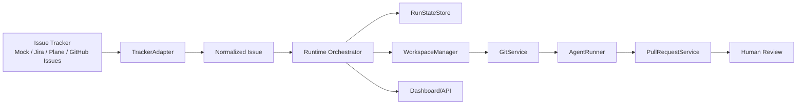

# Architecture

Owned Symphony is a tracker-agnostic coding-agent orchestrator. The intended shape is:

## Main Runtime Path

The primary runtime path is:

1. `src/cli/index.ts` loads and validates `WORKFLOW.md`.
2. `src/workflow/load.ts` and `src/workflow/schema.ts` parse config and front matter.
3. `src/trackers/createTracker.ts` creates a registered tracker adapter.
4. `src/orchestrator/orchestrator.ts` fetches active issues and coordinates work.
5. `src/workspaces/workspaceManager.ts` creates per-issue workspace paths.
6. `src/git/gitService.ts` clones/fetches and checks out the issue branch.
7. `src/templates/promptRenderer.ts` renders the prompt.
8. `src/agents/createAgentRunner.ts` creates a registered runner.
9. `src/github/pullRequestService.ts` commits, pushes, and creates a draft PR.
10. The tracker adapter comments and transitions the issue to Human Review when supported.

## Key Interfaces

| Boundary | Interface / module | Implementations |
| --- | --- | --- |
| Tracker | `TrackerAdapter` in `src/trackers/tracker.ts` | Mock, Jira, Plane, GitHub Issues |
| Agent | `AgentRunner` in `src/agents/agentRunner.ts` | DryRun, Codex, Claude Code, Shell |
| State | `RunStateStore` in `src/state/runStateStore.ts` | Memory, JSON, Postgres |
| Workspace | `WorkspaceManager` | Local filesystem workspace |
| Pull requests | `PullRequestService` | GitHub draft PRs through `gh` |
| Process execution | `ProcessExecutor` | Node child process executor |

## State Stores

| Store | Use case | Limitations |
| --- | --- | --- |
| `memory` | Tests and local experimentation | Lost on restart |
| `json` | Local Docker Compose demos | Not safe for distributed workers |
| `postgres` | Production daemon state | Current implementation shells out to `psql` |

The runtime state model supports discovered, queued, preparing, running, creating PR, tracker
writeback, succeeded, retryable failure, terminal failure, human attention, and cancelled states.

## Dashboard And API

There are two UI/API surfaces:

- `src/dashboard/*`: daemon status dashboard for runtime polling status.
- `src/server/api.ts` + `ui/`: local operator API and React UI, currently backed by the older MVP JSON run store.

This split is functional but should be unified before an MVP release.

## Current Coupling

The project is mostly modular, but these areas still couple core paths to concrete providers:

- `src/orchestrator/orchestrator.ts` defaults directly to `createTracker`, `createAgentRunner`,
  `GitService`, and `GitHubPullRequestService`. It accepts injected dependencies, but the default
  constructor still wires concrete services.
- `src/core/orchestrator.ts` is an older MVP path that imports `MockTrackerAdapter`,
  `AgentRunnerFactory`, and `DefaultGitHubOutputService` directly.
- `src/core/domain.ts` hardcodes `TrackerKind = "mock" | "jira" | "plane"` and does not include
  GitHub Issues or custom trackers.
- `src/cli/index.ts` has provider-specific redaction and conversion logic for Jira, Plane, and
  GitHub Issues.
- `src/workflow/schema.ts` requires a top-level `github` block for draft PR configuration, so GitHub
  is the only PR output path in the runtime config.
- `src/git/gitService.ts` uses direct `spawn` rather than the guarded `ProcessExecutor` boundary.
- `src/server/api.ts` reads mock issue files and `.orchestrator/runs.json` instead of the runtime
  `RunStateStore`.

## Recommended Direction

1. Make the runtime orchestrator the single source of truth.
2. Move MVP/core compatibility behind adapters or retire it.
3. Introduce a generic `PullRequestProvider` registry, with GitHub as the first provider.
4. Move Git command execution behind `ProcessExecutor`.
5. Make API/UI read from `RunStateStore` instead of MVP JSON files.
6. Keep tracker and runner factories as extension points.
7. Keep dashboard and API local-only until auth exists.
