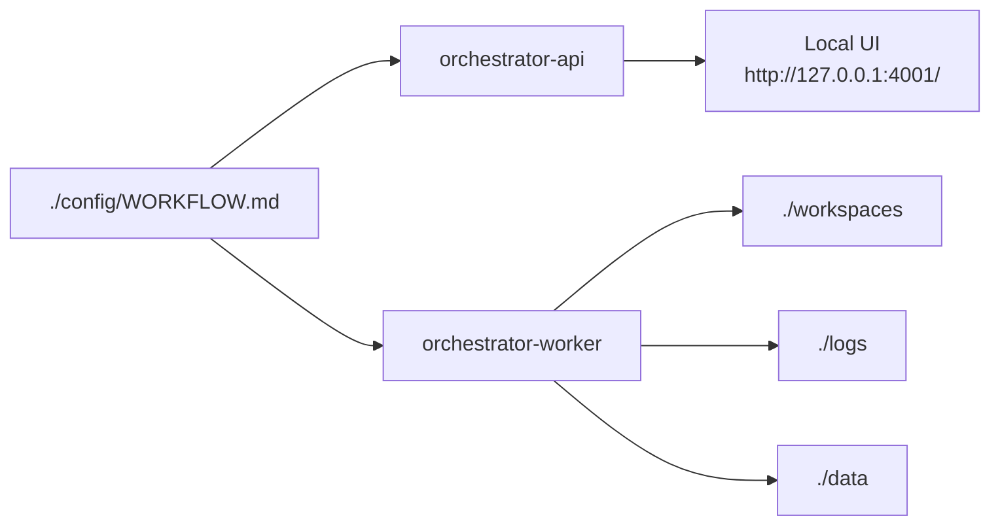

# Deployment

This guide covers the local/server Docker Compose runtime for the owned Symphony-style orchestrator.

> [!WARNING]
> The Compose file is designed for local or private server deployment. It binds the operator UI/API to
> `127.0.0.1` on the host and does not expose a public dashboard by default.

## What Runs



| Service | Command | Purpose |
| --- | --- | --- |
| `orchestrator-api` | `node dist/cli/index.js api /config/WORKFLOW.md --host 0.0.0.0 --port 4001` | Serves the local JSON API and built UI. Host publishing is still localhost-only. |
| `orchestrator-worker` | `node dist/cli/index.js run /config/WORKFLOW.md --poll` | Runs the polling worker loop. |

## Prepare Local Files

```bash
mkdir -p config workspaces logs data
cp examples/WORKFLOW.docker.mock.example.md config/WORKFLOW.md
cp examples/mock-issues.json config/mock-issues.json
mkdir -p config/template-repo
git -C config/template-repo init -b main
git -C config/template-repo config user.email "local@example.invalid"
git -C config/template-repo config user.name "Local Demo"
printf "# Docker demo repo\n" > config/template-repo/README.md
git -C config/template-repo add README.md
git -C config/template-repo commit -m "Initial demo repo"
```

`config/WORKFLOW.md` should use mounted container paths:

```yaml
tracker:
  kind: mock
  issue_file: /config/mock-issues.json
  events_file: /data/mock-tracker-events.json

state:
  kind: json
  file_path: /data/run-state.json

workspace:
  root: /workspaces

repository:
  url: /config/template-repo
  base_branch: main

github:
  log_dir: /logs

agent:
  log_dir: /logs
```

The JSON state store is useful for local Compose deployments because it persists worker state in
`./data/run-state.json` without requiring a database. Use Postgres for higher-volume or multi-worker
production setups.

## Environment Variables

Secrets are passed at runtime. Do not copy them into the Dockerfile or workflow files.

| Variable | Used by |
| --- | --- |
| `JIRA_EMAIL` | Jira tracker authentication |
| `JIRA_API_TOKEN` | Jira tracker authentication |
| `PLANE_API_TOKEN` | Plane tracker authentication |
| `OPENAI_API_KEY` | Codex or provider tooling, when needed |
| `GITHUB_TOKEN` | GitHub APIs or tools |
| `GH_TOKEN` | GitHub CLI, if you use `gh` |
| `ANTHROPIC_API_KEY` | Claude Code, if your runner setup needs it |
| `DATABASE_URL` | Optional Postgres-backed state |

Use a local `.env` file for development if you want Compose to load these values automatically.

## Build And Start

```bash
docker compose build
docker compose up -d
```

Check service status:

```bash
docker compose ps
docker compose logs -f orchestrator-api
docker compose logs -f orchestrator-worker
```

Open the UI:

```text
http://127.0.0.1:4001/
```

Check API health:

```bash
curl http://127.0.0.1:4001/api/health
```

## Volumes

| Host path | Container path | Purpose |
| --- | --- | --- |
| `./config` | `/config` | Workflow files and non-secret config. Mounted read-only. |
| `./workspaces` | `/workspaces` | Per-issue workspaces and repository clones. |
| `./logs` | `/logs` | Agent, GitHub, and command logs. |
| `./data` | `/data` | Local JSON state and mock tracker event files. |

## Safe Defaults

- The API/UI port is published as `127.0.0.1:4001:4001`, not publicly.
- The worker uses `run --poll`, which is equivalent to daemon polling through the existing CLI.
- Workspaces are not deleted by default.
- No automatic merge behavior is implemented.
- Logs are passed through the project redaction helpers, but you should still keep ticket content and
  runner prompts private.

## Reverse Proxy Placeholder

Do not put the UI/API behind a public reverse proxy until you add authentication, authorization,
TLS, rate limiting, and an explicit secret review. If you add a proxy, keep the upstream service on
a private network and avoid exposing the dashboard directly.

## Limitations

- The image includes Node.js, Git, OpenSSH, curl, and GitHub CLI. It does not install Codex,
  Claude Code, Aider, or custom internal agent CLIs.
- The local JSON state store is not a distributed lock manager. Use Postgres for production workers
  that need stronger durability and concurrency safety.
- The UI is still an operator console. It does not edit workflows, retry runs, cancel runs, or merge PRs.
